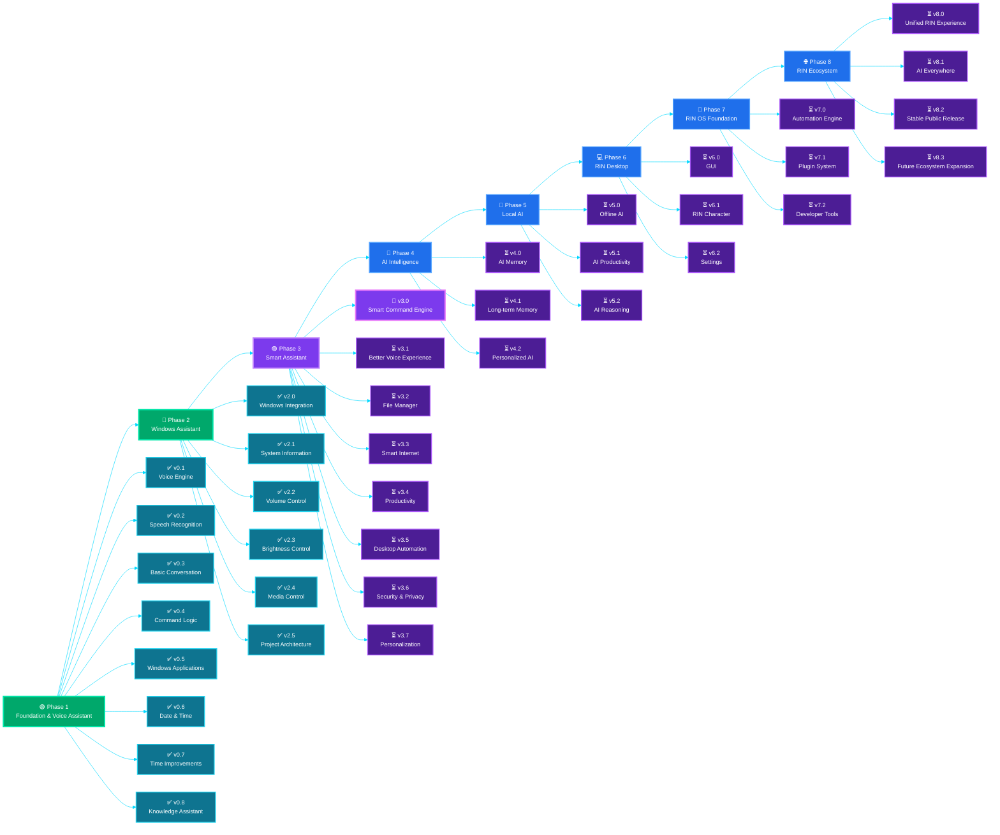

<p align="center">
  
</p>

---

<p align="center">
  
</p>

---

<p align="center">

  

  

  

  

  

  

  

  

</p>

---

<p align="center">

  

  

  

  

</p>

<p align="center">

🚀 **CURRENT DEVELOPMENT** • **Phase 3 — Smart Assistant** • **Next Version: v3.0**

✅ **Phase 1 and Phase 2 Successfully Completed**

</p>

---

<h1 align="center">
🤖 RIN AI Voice Assistant
</h1>

<p align="center">
An Intelligent Desktop Assistant Built with Python
</p>

RIN is a long-term AI project that I am building from scratch to become a smart desktop assistant capable of understanding voice commands, automating daily tasks, controlling Windows features, and assisting with productivity.

---

# 📌 Project Summary

| Feature | Details |
|---|---|
| 🤖 Project | Personal AI Voice Assistant |
| 🐍 Language | Python |
| 🎙️ Voice Recognition | Active |
| 🔊 Text-to-Speech | Female AI Voice |
| 💻 Desktop Automation | Active |
| 📁 Apps & Folders | Supported |
| 🌐 Website Commands | Supported |
| 📊 System Monitoring | Battery, CPU, RAM & Disk |
| 🔉 Volume Control | Supported |
| 🔆 Brightness Control | Supported |
| 🎵 Media Control | Supported |
| 🧱 Project Architecture | Modular |
| ✅ Latest Completed Version | RIN v2.5 |
| 🚀 Current Target | v3.0 — Smart Command Engine |
| 📍 Status | Active Development |

---

# 🚀 Current Development

## Phase 2 Completed — Windows Assistant

RIN has successfully completed **Phase 2**, which focused on Windows integration, system controls, media commands, and a cleaner modular project structure.

### ✅ Completed Phase 2 Versions

- ✅ **v2.0 — Windows Integration**
- ✅ **v2.1 — System Information**
- ✅ **v2.2 — Volume Control**
- ✅ **v2.3 — Brightness Control**
- ✅ **v2.4 — Media Control**
- ✅ **v2.5 — Project Architecture**

### 🎯 Current Target

## v3.0 — Smart Command Engine

The next version will improve how RIN understands and processes commands.

### Planned Improvements

- 🧠 Better command matching
- 🔁 Command aliases
- 💬 Flexible sentence recognition
- ⚡ Faster command routing
- ❓ Smarter unknown command handling
- 🧹 Cleaner command parser

**Status:** 🚧 Ready to Begin

---

# ✨ Current Features

## 🎙️ Voice Intelligence

- 🎤 Voice Recognition
- 🗣️ Female AI Voice
- 🔁 Continuous Listening
- 💬 Natural AI Responses
- ❓ Unknown Command Handling
- 👋 Greeting Responses

## 💻 Desktop Automation

- 📁 Open Windows Folders
- 🖥️ Open Desktop Applications
- 🌐 Open Websites
- 📚 Wikipedia Search
- 🕒 Current Time
- 📅 Current Date
- 🗂️ Open RIN Project Folder
- 🌍 Browser Commands

## 📊 System Monitoring

- 🔋 Battery Monitoring
- 🔌 Charging Status
- 🧠 CPU Usage
- 💾 RAM Usage
- 💿 Disk Usage

## 🔉 Volume Control

- 🔊 Increase Volume
- 🔉 Decrease Volume
- 🎚️ Set Volume
- 🔇 Mute
- 🔈 Unmute

## 🔆 Brightness Control

- ☀️ Increase Brightness
- 🌙 Decrease Brightness
- 🎚️ Set Brightness

## 🎵 Media Control

- ▶️ Play Media
- ⏸️ Pause Media
- 🔄 Resume Media
- ⏭️ Next Track
- ⏮️ Previous Track
- ⏹️ Stop Media

## ⚙️ Project Architecture

- 🧩 Modular Python Structure
- 🧠 Separate Command Logic
- ⚙️ Central Configuration
- 🖥️ Separate System Controls
- 📂 Dynamic Folder Paths
- 🛡️ Better Error Handling
- 📄 Professional Documentation

---

# 📖 About RIN

**RIN — Responsive Intelligent Network** is my personal AI voice assistant project built entirely in Python.

I started this project to learn Artificial Intelligence, Python automation, voice interaction, desktop control, and software engineering by building a real-world application from scratch instead of only following tutorials.

The long-term vision of RIN is to become an intelligent desktop companion that can understand natural voice commands, automate daily tasks, assist with productivity, remember useful information, and continuously evolve through new versions.

Every version introduces new capabilities, making RIN smarter, more reliable, and closer to becoming a complete AI assistant.

This repository documents the complete development journey — from the first voice response to a future AI-powered desktop ecosystem.

---

# 💡 Why RIN?

Unlike traditional voice assistants, RIN is a long-term personal AI project focused on learning and building real-world desktop automation from scratch.

The goal is to create an intelligent assistant that can:

- 🎙️ Understand natural voice commands
- 🖥️ Control desktop applications
- 📁 Manage files and folders
- 🌐 Browse websites
- 📊 Monitor system performance
- 🔉 Control system volume
- 🔆 Control screen brightness
- 🎵 Control media playback
- ⚡ Automate daily tasks
- 🧠 Remember useful information
- 🤖 Continuously evolve with AI capabilities

---

# 🔄 Project Workflow

```text
        🎙️ Voice Input
               │
               ▼
     🗣️ Speech Recognition
               │
               ▼
       🧠 Command Processing
               │
               ▼
        ⚙️ Decision Engine
               │
      ┌────────┼─────────┐
      ▼        ▼         ▼
   📁 Apps   🌐 Web    🗂️ Folders
      │        │         │
      └────────┼─────────┘
               ▼
      🖥️ System Controls
               │
               ▼
       🔊 AI Voice Response
```

### Workflow

- 🎙️ Listen to the user's voice command
- 🗣️ Convert speech into text
- 🧠 Understand and process the command
- ⚙️ Decide which module should handle it
- 💻 Execute the requested task
- 🔊 Respond with a natural AI voice

---

# 🛠️ Tech Stack

<p align="center">

  

  

  

  

  

  

  

</p>

---

## ⚡ RIN Capabilities


---

# 📁 Project Structure

```text
RIN-AI-Voice-Assistant/
│
├── .gitignore
├── LICENSE
├── README.md
├── ROADMAP.md
├── DEVELOPMENT.md
├── SECURITY.md
├── CONTRIBUTING.md
├── CODE_OF_CONDUCT.md
├── requirements.txt
│
├── main.py
├── commands.py
├── config.py
├── system_controls.py
├── data.py
│
├── apps.py
├── folders.py
├── websites.py
├── system_info.py
│
└── rin.png
```

> The project structure may continue to evolve as new versions and modules are added.

---

# 🚧 Current Development Status

> **RIN is currently under active development.**

Phase 1 and Phase 2 are complete.

The project is now moving into:

## 🟣 Phase 3 — Smart Assistant

### Current Focus

- 🚀 Building v3.0 — Smart Command Engine
- 🧠 Improving command understanding
- 🔁 Adding command aliases
- 💬 Supporting flexible sentence structures
- ⚡ Improving command routing speed
- 🧹 Building a cleaner command parser

### Development Status

| Item | Status |
|---|---|
| Phase 1 — Foundation & Voice Assistant | ✅ Completed |
| Phase 2 — Windows Assistant | ✅ Completed |
| Phase 3 — Smart Assistant | 🚧 Starting |
| Current Target | v3.0 |
| Latest Completed Version | v2.5 |

⚠️ The installation guide and full setup instructions will be added after RIN reaches a stable public release.

Thank you for following the RIN development journey! 💙

---

# 🗺️ Future Roadmap

## 🟢 Phase 1 — Foundation & Voice Assistant

- ✅ v0.1 — Voice Engine
- ✅ v0.2 — Speech Recognition
- ✅ v0.3 — Basic Conversation
- ✅ v0.4 — Command Logic
- ✅ v0.5 — Windows Applications
- ✅ v0.6 — Date & Time
- ✅ v0.7 — Time Improvements
- ✅ v0.8 — Knowledge Assistant

---

## 🔵 Phase 2 — Windows Assistant

- ✅ v2.0 — Windows Integration
- ✅ v2.1 — System Information
- ✅ v2.2 — Volume Control
- ✅ v2.3 — Brightness Control
- ✅ v2.4 — Media Control
- ✅ v2.5 — Project Architecture

---

## 🟣 Phase 3 — Smart Assistant

- 🚧 v3.0 — Smart Command Engine
- ⏳ v3.1 — Better Voice Experience
- ⏳ v3.2 — File Manager
- ⏳ v3.3 — Smart Internet
- ⏳ v3.4 — Productivity
- ⏳ v3.5 — Desktop Automation
- ⏳ v3.6 — Security & Privacy
- ⏳ v3.7 — Personalization

---

## 🧠 Phase 4 — AI Intelligence

- ⏳ v4.0 — AI Memory
- ⏳ v4.1 — Long-term Memory
- ⏳ v4.2 — Personalized AI

---

## 🤖 Phase 5 — Local AI

- ⏳ v5.0 — Offline AI
- ⏳ v5.1 — AI Productivity
- ⏳ v5.2 — AI Reasoning

---

## 💻 Phase 6 — RIN Desktop

- ⏳ v6.0 — GUI
- ⏳ v6.1 — RIN Character
- ⏳ v6.2 — Settings

---

## 🚀 Phase 7 — RIN OS Foundation

- ⏳ v7.0 — Automation Engine
- ⏳ v7.1 — Plugin System
- ⏳ v7.2 — Developer Tools

---

## 🌐 Phase 8 — RIN Ecosystem

- ⏳ v8.0 — Unified RIN Experience
- ⏳ v8.1 — AI Everywhere
- ⏳ v8.2 — Stable Public Release
- ⏳ v8.3 — Future Ecosystem Expansion

---

# 📈 Development Timeline

| Version | Development Milestone | Status |
|---|---|---|
| v0.1–v0.8 | Foundation & Voice Assistant | ✅ Completed |
| v2.0–v2.5 | Windows Assistant | ✅ Completed |
| v3.0–v3.7 | Smart Assistant | 🚧 Current Phase |
| v4.0–v4.2 | AI Intelligence | ⏳ Planned |
| v5.0–v5.2 | Local AI | ⏳ Planned |
| v6.0–v6.2 | RIN Desktop | ⏳ Planned |
| v7.0–v7.2 | RIN OS Foundation | ⏳ Planned |
| v8.0–v8.3 | RIN Ecosystem | ⏳ Planned |

---

# 📉 RIN Development Journey



---

# ⭐ Project Status

🚀 **Active Development**

**Latest Completed Version:** v2.5 — Project Architecture

**Completed Phases:**

- ✅ Phase 1 — Foundation & Voice Assistant
- ✅ Phase 2 — Windows Assistant

**Current Phase:** Phase 3 — Smart Assistant

**Current Target:** v3.0 — Smart Command Engine

**Next Milestone:** v3.1 — Better Voice Experience

---

<p align="center">
⭐ If you found this project helpful, consider giving it a Star on GitHub!
</p>

<p align="center">
Made with 💙 by <b>Ravi Suthar</b>
</p>
