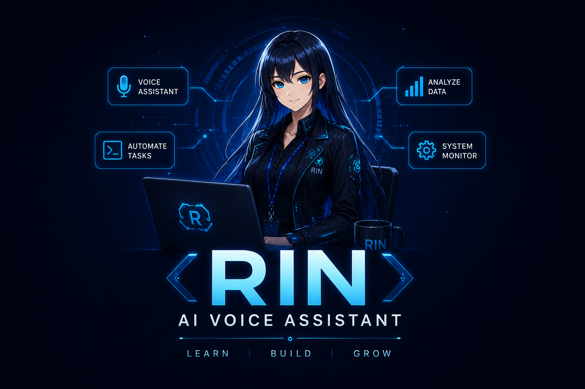
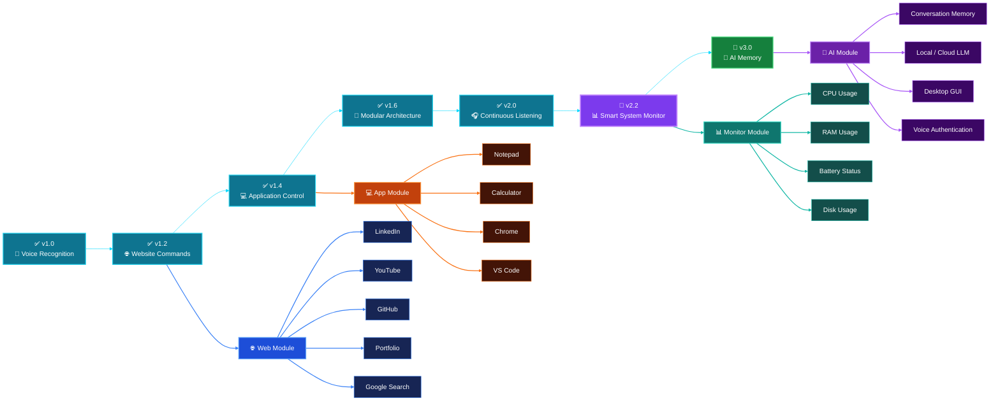

<p align="center">
  
</p>

---

<p align="center">
  
</p>

---

<p align="center">


</p>

---

<p align="center">


</p>
<p align="center">

🚧 <b>EARLY DEVELOPMENT BUILD</b> • Version <b>v2.2</b> • ⭐ Stable Release Coming in <b>v3.0</b>

</p>

---

<h1 align="center">
🤖 RIN AI Voice Assistant
</h1>

<p align="center">
An Intelligent Desktop Assistant built with Python
</p>

RIN is a long-term AI project that I am building from scratch to become a smart desktop assistant capable of understanding voice commands, automating daily tasks, and assisting with productivity.

---

## 📌 Project Summary

| Feature | Details |
|---------|---------|
| 🤖 Project | Personal AI Voice Assistant |
| 🐍 Language | Python |
| 🎙️ Voice Recognition | Active |
| 🔊 Text-to-Speech | Female AI Voice |
| 🖥️ Desktop Automation | Active |
| 📂 Apps & Folders | Supported |
| 🌐 Website Commands | Supported |
| 📊 System Monitoring | Battery, CPU, RAM & Disk |
| 📦 Current Version | RIN v2.2 |
| 🚀 Status | Active Development |

---

---

# 🚀 Current Version

## **RIN v2.2 — Smart System Monitor**

Current stable release with intelligent desktop automation and real-time system monitoring.

### ✨ Highlights

- 🎤 Voice Recognition
- 🎧 Continuous Listening
- 🖥️ Desktop Automation
- 📊 System Monitoring
- 🌐 Website Automation
- 📂 Folder Navigation
- 💬 Natural AI Voice Responses

---

# ✨ Current Features

### 🎤 Voice Intelligence

- 🎙️ Voice Recognition
- 🗣️ Female AI Voice
- 🔄 Continuous Listening

### 🖥️ Desktop Automation

- 📂 Open Windows Folders
- 🪟 Open Desktop Applications
- 🌐 Open Websites
- 📚 Wikipedia Search
- 🕒 Current Time & Date

### 📊 System Monitoring

- 🔋 Battery Monitoring
- 🧠 CPU Usage
- 💾 RAM Usage
- 💿 Disk Usage

### ⚙️ Voice Commands

- 🔴 Voice Shutdown Commands

---
# 📖 About RIN

RIN (Responsive Intelligent Network) is my personal AI voice assistant project built entirely in Python.

I started this project to learn Artificial Intelligence, Python automation, and software engineering by building a real-world application from scratch instead of following tutorials.

The long-term vision of RIN is to become an intelligent desktop companion that can understand natural voice commands, automate daily tasks, assist with productivity, and continuously evolve through new versions.

Every version introduces new capabilities, making RIN smarter, more reliable, and closer to a complete AI assistant.

This repository documents the complete development journey—from the very first voice response to future AI-powered automation.

---

# 💡 Why RIN?

Unlike traditional voice assistants, RIN is a long-term personal AI project focused on learning and building real-world desktop automation from scratch.

The goal is to create an intelligent assistant that can:

- 🎤 Understand natural voice commands
- 🖥 Control desktop applications
- 📂 Manage files and folders
- 🌐 Browse websites
- 📊 Monitor system performance
- 🤖 Continuously evolve with AI capabilities

---

# 🔄 Project Workflow

```text
        🎙️ Voice Input
              │
              ▼
   🗣️ Speech Recognition
              │
              ▼
     🧠 Command Processing
              │
              ▼
      ⚙️ Decision Engine
              │
 ┌────────────┼────────────┐
 │            │            │
 ▼            ▼            ▼
📂 Apps    🌐 Websites   📁 Folders
 │
 ▼
💻 System Monitoring
 │
 ▼
🔊 AI Voice Response
```

### Workflow

- 🎙️ Listen to the user's voice command
- 🗣️ Convert speech into text
- 🧠 Understand the command
- ⚙️ Decide which module should handle it
- 📂 Execute the requested task
- 🔊 Respond with a natural AI voice

---

# 🛠️ Tech Stack

<p align="center">
  
  
  
  
  
</p>

---

### ⚡ RIN Capabilities


---

# 📂 Project Structure

```text
RIN-AI-Voice-Assistant/
│
├── .gitignore
├── LICENSE
├── README.md
├── apps.py
├── data.py
├── folders.py
├── main.py
├── requirements.txt
├── rin.png
├── system_info.py
└── websites.py
```

---

## 🚧 Current Development Status

> **RIN is currently under active development.**

This repository documents the complete journey of building an AI-powered desktop assistant from scratch.

⚠️ The installation guide and setup instructions will be added after the project reaches its first stable release (**v3.0**).

Current focus:

- 🚀 Improving desktop automation
- 🧠 Expanding AI capabilities
- 🎙️ Enhancing voice interaction
- 🛠️ Building a stable architecture

Thank you for following the RIN development journey! 💙

---

# 🚀 Future Roadmap

- 🧠 Offline AI conversation
- 🎙️ Custom wake word detection
- 📅 Calendar & reminder management
- 📧 Email automation
- 🌦️ Weather forecasting
- 🎵 Music & media control
- 🤖 LLM integration (OpenAI / Local AI)
- 🖥️ GUI desktop interface
- 🔒 Voice authentication
- ☁️ Cross-device synchronization

---

# 📈 Development Timeline

| Version | Features |
|---------|----------|
| v1.0 | Voice Recognition |
| v1.2 | Open Websites |
| v1.4 | Open Applications |
| v1.6 | Modular Architecture |
| v2.0 | Continuous Listening |
| v2.2 | Smart System Monitor |
| 🚀 Future | AI Memory, LLM Integration, GUI |

---

## 📈 RIN Development Journey


---

## ⭐ Project Status

🚀 Active Development

Current Version: v2.2

Next Milestone: v3.0

---

<p align="center">
⭐ If you found this project helpful, consider giving it a Star on GitHub!
</p>

<p align="center">
Made with ❤️ by <b>Ravi Suthar</b>
</p>
