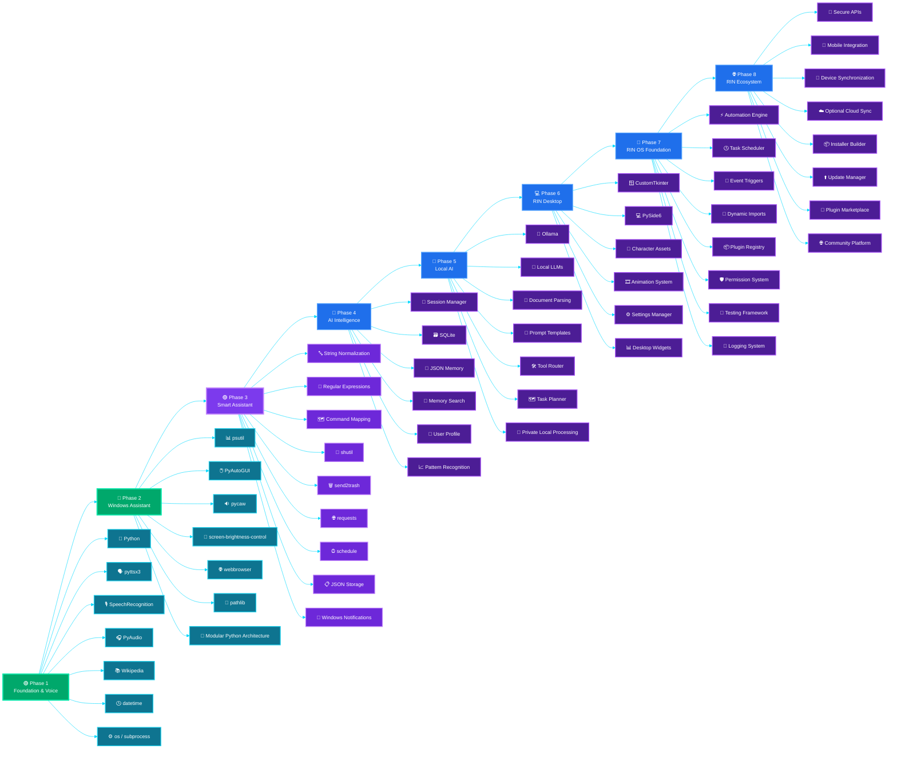

# 🤖 RIN AI Assistant Roadmap

Welcome to the official development roadmap of **RIN (Responsive Intelligent Network)**.

This document tracks the current progress of the project, completed features, future improvements, planned technologies, and the long-term vision of RIN.

---

# 📌 Project Information

| Item | Details |
|---|---|
| Project Name | RIN — Responsive Intelligent Network |
| Developer | Ravi Suthar |
| Language | Python |
| Platform | Windows |
| Latest Completed Version | v2.5 |
| Current Phase | Phase 3 — Smart Assistant |
| Current Target | v3.0 — Smart Command Engine |
| Status | 🟢 Active Development |

---

# 🗂️ Status Legend

| Symbol | Meaning |
|---|---|
| ✅ | Completed |
| 🔄 | Completed but may be improved |
| 🚧 | Currently in Development |
| ⬜ | Planned |
| ❌ | Removed / Deprecated |

---

# ✅ Phase 1 — Foundation & Voice Assistant

## 🎯 Goal

Build the core voice assistant foundation capable of listening, understanding basic commands, responding naturally, and performing simple desktop actions.

---

## ✅ Versions Completed

### ✅ v0.1 — Voice Engine

- Text-to-Speech
- Female AI Voice
- Voice Configuration
- Speaking Function

### ✅ v0.2 — Speech Recognition

- Microphone Input
- Speech Recognition
- Wake Command
- Voice-to-Text Processing

### ✅ v0.3 — Basic Conversation

- Greetings
- AI Introduction
- Basic Conversation
- Unknown Command Handling

### ✅ v0.4 — Command Logic

- `if / elif / else` Command System
- Command Processing
- Better Responses
- Basic Error Handling

### ✅ v0.5 — Windows Applications

- Open Notepad
- Open Calculator
- Open Chrome
- Launch Installed Applications

### ✅ v0.6 — Date & Time

- Current Time
- Current Date
- Voice-Based Time Commands

### ✅ v0.7 — Time Improvements

- Better Time Command Detection
- Multiple Time Sentence Support
- More Natural Time Responses

### ✅ v0.8 — Knowledge Assistant

- Wikipedia Search
- Basic Information Lookup
- Knowledge-Based Voice Responses

---

## ✅ Features Completed

### 🎙️ Voice Recognition

- ✅ Speech Recognition
- ✅ Wake Command
- ✅ Continuous Listening
- ✅ Command Processing

### 🗣️ Voice Response

- ✅ Text-to-Speech
- ✅ Female AI Voice
- ✅ Natural Voice Output
- ✅ Basic Response Handling

### 🧠 Basic Intelligence

- ✅ Greetings
- ✅ Current Time
- ✅ Current Date
- ✅ Basic Conversation
- ✅ Unknown Command Response

### 🌐 Knowledge

- ✅ Wikipedia Search
- ✅ Basic Information Lookup

### 💻 Applications

- ✅ Open Notepad
- ✅ Open Calculator
- ✅ Open Chrome
- ✅ Launch Windows Applications

---

## 🔄 Future Improvements

- ⬜ Offline Speech Recognition
- ⬜ Faster Wake Word Detection
- ⬜ Better Noise Filtering
- ⬜ Multiple Voice Options
- ⬜ Emotion Detection
- ⬜ More Natural Conversations

---

## 📦 Libraries Used

- `pyttsx3`
- `SpeechRecognition`
- `PyAudio`
- `audioop-lts`
- `wikipedia`
- `os`
- `subprocess`
- `datetime`

---

## ☑️ Phase Status

**Status:** ✅ Completed

**Versions:** v0.1 → v0.8

---

# ✅ Phase 2 — Windows Assistant

## 🎯 Goal

Transform RIN from a basic voice assistant into a Windows desktop assistant capable of controlling applications, websites, system information, volume, brightness, media, and project modules.

---

## ✅ Versions Completed

### ✅ v2.0 — Windows Integration

- Website Launcher
- Application Launcher
- Folder Navigation
- Wikipedia Commands
- Custom Website Support

### ✅ v2.1 — System Information

- Battery Information
- Charging Status
- CPU Usage
- RAM Usage
- Disk Usage

### ✅ v2.2 — Volume Control

- Increase Volume
- Decrease Volume
- Set Volume
- Current Volume
- Mute
- Unmute

### ✅ v2.3 — Brightness Control

- Increase Brightness
- Decrease Brightness
- Set Brightness
- Current Brightness

### ✅ v2.4 — Media Control

- Play Media
- Pause Media
- Resume Media
- Next Track
- Previous Track
- Stop Media

### ✅ v2.5 — Project Architecture

- Modular Project Structure
- `commands.py`
- `config.py`
- `system_controls.py`
- `data.py` Cleanup
- Dynamic Paths
- GitHub Cleanup
- Professional Documentation
- Requirements Management
- Security and Contribution Files

---

## ✅ Features Completed

### 📁 Folder Navigation

- ✅ Open RIN Project Folder
- ✅ Open Custom Folders
- ✅ Dynamic Folder Paths

### 🖥️ Applications

- ✅ Open Notepad
- ✅ Open Calculator
- ✅ Open Chrome
- ✅ Open VS Code
- ✅ Open Installed Applications

### 🌐 Websites

- ✅ Open Google
- ✅ Open YouTube
- ✅ Open GitHub
- ✅ Open LinkedIn
- ✅ Open Portfolio
- ✅ Open Custom Websites

### 📊 System Monitoring

- ✅ Battery Information
- ✅ Charging Status
- ✅ CPU Usage
- ✅ RAM Usage
- ✅ Disk Usage

### 🔉 Volume Control

- ✅ Volume Up
- ✅ Volume Down
- ✅ Set Volume
- ✅ Current Volume
- ✅ Mute
- ✅ Unmute

### 🔆 Brightness Control

- ✅ Increase Brightness
- ✅ Decrease Brightness
- ✅ Set Brightness
- ✅ Current Brightness

### 🎵 Media Control

- ✅ Play
- ✅ Pause
- ✅ Resume
- ✅ Next Track
- ✅ Previous Track
- ✅ Stop Media

### 🧱 Project Architecture

- ✅ Modular Architecture
- ✅ Separate Command Logic
- ✅ Central Configuration
- ✅ Separate System Controls
- ✅ Dynamic Paths
- ✅ Cleaner Data Management
- ✅ Better Documentation
- ✅ GitHub Repository Cleanup

---

## 🔄 Future Improvements

### 🖥️ Applications

- ⬜ Auto Search Installed Applications
- ⬜ Dynamic Application Detection
- ⬜ Application Profiles

### 📁 Folders

- ⬜ Automatic Folder Search
- ⬜ Recent Folder Detection
- ⬜ Favorite Folder Support

### 📊 System Monitoring

- ⬜ CPU Temperature
- ⬜ GPU Information
- ⬜ Motherboard Information
- ⬜ Disk Health
- ⬜ Network Information
- ⬜ System Uptime

### 🔉 Volume

- ⬜ Per-Application Volume Control
- ⬜ Select Audio Output Device
- ⬜ Automatic Volume Profiles

### 🔆 Brightness

- ⬜ Multiple Monitor Support
- ⬜ Adaptive Brightness
- ⬜ Night Mode

### 🎵 Media

- ⬜ Detect Active Media Player
- ⬜ Browser-Aware Media Controls
- ⬜ Spotify Integration
- ⬜ VLC Integration
- ⬜ Seek Forward
- ⬜ Seek Backward
- ⬜ Fullscreen Control
- ⬜ Captions Control

---

## 📦 Libraries Used

- `os`
- `subprocess`
- `webbrowser`
- `psutil`
- `pyautogui`
- `pycaw`
- `screen-brightness-control`
- `pathlib`

---

## ☑️ Phase Status

**Status:** ✅ Completed

**Versions:** v2.0 → v2.5

**Latest Completed Version:** v2.5 — Project Architecture

---

# 🚧 Phase 3 — Smart Assistant

## 🎯 Goal

Make RIN smarter, more flexible, productive, secure, and useful for daily desktop work.

---

## 🚧 v3.0 — Smart Command Engine

### 🎯 Goal

Improve how RIN understands, matches, routes, and processes user commands.

### 🚧 Planned Features

- 🚧 Better Command Matching
- 🚧 Command Aliases
- 🚧 Flexible Sentence Recognition
- 🚧 Smarter Unknown Command Handling
- 🚧 Faster Command Routing
- 🚧 Cleaner Command Parser
- 🚧 Modular Command Registry
- 🚧 Improved Command Priority
- 🚧 Duplicate Command Prevention

### 📦 Planned Technologies

- Python Functions
- Dictionaries
- Regular Expressions
- Command Mapping
- Modular Routing
- String Normalization

### ☑️ Version Status

**Status:** 🚧 Current Development Target

**Version:** v3.0

---

## ⬜ v3.1 — Better Voice Experience

### 🎯 Goal

Improve listening quality, microphone handling, wake-word behavior, and natural voice responses.

### ⬜ Planned Features

- ⬜ Better Wake Word Handling
- ⬜ Faster Listening
- ⬜ Improved Microphone Handling
- ⬜ Noise Filtering
- ⬜ Multiple Greetings
- ⬜ Natural Speaking Flow
- ⬜ Listening Timeout Control
- ⬜ Retry After Recognition Failure
- ⬜ Better Voice Feedback

### 📦 Planned Technologies

- `SpeechRecognition`
- `PyAudio`
- Noise Calibration
- Microphone Configuration
- Voice Response Templates

### ☑️ Version Status

**Status:** ⬜ Planned

**Version:** v3.1

---

## ⬜ v3.2 — File Manager

### 🎯 Goal

Allow RIN to manage files and folders safely using voice commands.

### ⬜ Planned Features

- ⬜ Search Files
- ⬜ Search Folders
- ⬜ Find Recent Files
- ⬜ Create File
- ⬜ Create Folder
- ⬜ Rename Files
- ⬜ Rename Folders
- ⬜ Copy Files
- ⬜ Move Files
- ⬜ Delete Files
- ⬜ Delete Folders
- ⬜ Confirmation Before Deletion
- ⬜ Recycle Bin Support

### 📦 Planned Technologies

- `pathlib`
- `shutil`
- `os`
- `send2trash`
- Windows File Search

### ☑️ Version Status

**Status:** ⬜ Planned

**Version:** v3.2

---

## ⬜ v3.3 — Smart Internet

### 🎯 Goal

Allow RIN to search the internet and access useful online information.

### ⬜ Planned Features

- ⬜ Google Search
- ⬜ YouTube Search
- ⬜ GitHub Search
- ⬜ Stack Overflow Search
- ⬜ Weather Information
- ⬜ News Information
- ⬜ Currency Converter
- ⬜ ChatGPT Shortcut
- ⬜ Gemini Shortcut
- ⬜ Search Query Detection
- ⬜ Open Search Results Automatically

### 📦 Planned Technologies

- `requests`
- `webbrowser`
- Weather API
- News API
- Currency API
- Search URLs

### ☑️ Version Status

**Status:** ⬜ Planned

**Version:** v3.3

---

## ⬜ v3.4 — Productivity

### 🎯 Goal

Help users stay organized and productive through voice-controlled tools.

### ⬜ Planned Features

- ⬜ Notes
- ⬜ Reminders
- ⬜ Alarms
- ⬜ Timer
- ⬜ Stopwatch
- ⬜ To-Do List
- ⬜ Daily Planner
- ⬜ Calendar
- ⬜ Open Recent Files
- ⬜ Clipboard Manager
- ⬜ Focus Mode

### 📦 Planned Technologies

- `schedule`
- `datetime`
- `time`
- `json`
- Local Storage
- Windows Notifications

### ☑️ Version Status

**Status:** ⬜ Planned

**Version:** v3.4

---

## ⬜ v3.5 — Desktop Automation

### 🎯 Goal

Allow RIN to automate desktop tasks using the mouse, keyboard, applications, and browser.

### ⬜ Planned Features

- ⬜ Mouse Control
- ⬜ Keyboard Automation
- ⬜ Type Text
- ⬜ Take Screenshot
- ⬜ Browser Automation
- ⬜ Window Management
- ⬜ Open Multiple Applications
- ⬜ Minimize Windows
- ⬜ Maximize Windows
- ⬜ Close Windows
- ⬜ Switch Applications
- ⬜ Multi-Step Desktop Workflows

### 📦 Planned Technologies

- `pyautogui`
- `pyperclip`
- `pillow`
- Browser Automation
- Windows APIs

### ☑️ Version Status

**Status:** ⬜ Planned

**Version:** v3.5

---

## ⬜ v3.6 — Security & Privacy

### 🎯 Goal

Provide useful Windows security, privacy, network, and system health information.

### ⬜ Planned Features

- ⬜ Windows Defender Status
- ⬜ Firewall Status
- ⬜ Startup Programs
- ⬜ Running Processes
- ⬜ Installed Software
- ⬜ Disk Health
- ⬜ Battery Health
- ⬜ Password Strength Checker
- ⬜ URL Safety Checker
- ⬜ File Hash Generator
- ⬜ Network Information
- ⬜ Public IP
- ⬜ Security Report
- ⬜ Suspicious Process Detection

### 📦 Planned Technologies

- `psutil`
- `hashlib`
- `subprocess`
- `socket`
- Windows Security Commands
- Network APIs

### ☑️ Version Status

**Status:** ⬜ Planned

**Version:** v3.6

---

## ⬜ v3.7 — Personalization

### 🎯 Goal

Allow RIN to adapt its settings and behavior according to the user.

### ⬜ Planned Features

- ⬜ User Name
- ⬜ Preferred Voice
- ⬜ Voice Speed
- ⬜ Voice Volume
- ⬜ Custom Wake Word
- ⬜ Default Browser
- ⬜ Default Search Engine
- ⬜ Language Preference
- ⬜ Theme Preference
- ⬜ Startup Settings
- ⬜ Favorite Applications
- ⬜ Favorite Websites

### 📦 Planned Technologies

- JSON Configuration
- Local Settings File
- User Profile
- Configuration Manager

### ☑️ Version Status

**Status:** ⬜ Planned

**Version:** v3.7

---

## ☑️ Phase Status

**Status:** 🚧 Current Phase

**Versions:** v3.0 → v3.7

**Current Target:** v3.0 — Smart Command Engine

---

# ⬜ Phase 4 — AI Intelligence

## 🎯 Goal

Give RIN memory, context awareness, learning behavior, and personalized intelligence.

---

## ⬜ v4.0 — AI Memory

### ⬜ Planned Features

- ⬜ Session Memory
- ⬜ Conversation Context
- ⬜ Temporary Task Memory
- ⬜ Context Awareness
- ⬜ Remember Current Conversation
- ⬜ Follow-Up Command Understanding

### 📦 Planned Technologies

- Python Memory Objects
- JSON
- Session Manager
- Conversation State

---

## ⬜ v4.1 — Long-Term Memory

### ⬜ Planned Features

- ⬜ User Preferences
- ⬜ Favorite Applications
- ⬜ Favorite Websites
- ⬜ Stored Routines
- ⬜ Local Memory Database
- ⬜ Searchable Memory
- ⬜ Memory Editing
- ⬜ Memory Deletion

### 📦 Planned Technologies

- SQLite
- JSON
- Local Database
- Memory Manager

---

## ⬜ v4.2 — Personalized AI

### ⬜ Planned Features

- ⬜ Learning Behavior
- ⬜ Personalized Responses
- ⬜ Smart Suggestions
- ⬜ Habit-Based Assistance
- ⬜ Routine Recommendations
- ⬜ Context-Based Actions

### 📦 Planned Technologies

- Local User Profile
- Pattern Recognition
- Recommendation Logic
- Memory Database

---

## ☑️ Phase Status

**Status:** ⬜ Planned

**Versions:** v4.0 → v4.2

---

# ⬜ Phase 5 — Local AI

## 🎯 Goal

Add private, offline AI conversation, productivity, and reasoning capabilities.

---

## ⬜ v5.0 — Offline AI

### ⬜ Planned Features

- ⬜ Ollama Integration
- ⬜ Local Language Models
- ⬜ Offline Conversation
- ⬜ Private AI Processing
- ⬜ Model Selection
- ⬜ Local Prompt System

### 📦 Planned Technologies

- Ollama
- Local LLMs
- Python API
- Local Model Runtime

---

## ⬜ v5.1 — AI Productivity

### ⬜ Planned Features

- ⬜ Document Summaries
- ⬜ Writing Assistance
- ⬜ Email Drafting
- ⬜ Code Assistance
- ⬜ Task Planning
- ⬜ Research Assistance
- ⬜ Text Rewriting
- ⬜ Content Generation

### 📦 Planned Technologies

- Local LLM
- Document Parsing
- Prompt Templates
- File Processing

---

## ⬜ v5.2 — AI Reasoning

### ⬜ Planned Features

- ⬜ Multi-Step Reasoning
- ⬜ Task Decomposition
- ⬜ Tool Selection
- ⬜ Intelligent Decision-Making
- ⬜ Planning Engine
- ⬜ Error Recovery
- ⬜ Goal-Based Actions

### 📦 Planned Technologies

- AI Agent Logic
- Tool Router
- Task Planner
- Reasoning Pipeline

---

## ☑️ Phase Status

**Status:** ⬜ Planned

**Versions:** v5.0 → v5.2

---

# ⬜ Phase 6 — RIN Desktop

## 🎯 Goal

Transform RIN into a complete visual desktop assistant with a GUI and animated character.

---

## ⬜ v6.0 — GUI

### ⬜ Planned Features

- ⬜ Desktop Application
- ⬜ Main Dashboard
- ⬜ Command Input
- ⬜ Command History
- ⬜ System Widgets
- ⬜ Settings Panel
- ⬜ Notifications
- ⬜ Floating Assistant

### 📦 Planned Technologies

- CustomTkinter
- PySide6
- Python GUI Framework
- Desktop Widgets

---

## ⬜ v6.1 — RIN Character

### ⬜ Planned Features

- ⬜ Animated RIN Character
- ⬜ Normal Mode
- ⬜ Listening Mode
- ⬜ Thinking Mode
- ⬜ Speaking Mode
- ⬜ Happy Mode
- ⬜ Error Mode
- ⬜ Facial Expressions
- ⬜ Voice Animation

### 📦 Planned Technologies

- Character Assets
- Animation System
- Sprite Management
- GUI Integration

---

## ⬜ v6.2 — Settings

### ⬜ Planned Features

- ⬜ Voice Settings
- ⬜ Theme Settings
- ⬜ Startup Behavior
- ⬜ Module Control
- ⬜ Privacy Controls
- ⬜ User Profile
- ⬜ Shortcut Settings
- ⬜ AI Model Settings

### 📦 Planned Technologies

- Settings Database
- JSON Configuration
- GUI Controls
- Profile Manager

---

## ☑️ Phase Status

**Status:** ⬜ Planned

**Versions:** v6.0 → v6.2

---

# ⬜ Phase 7 — RIN OS Foundation

## 🎯 Goal

Build the technical foundation for a larger RIN-powered operating environment.

---

## ⬜ v7.0 — Automation Engine

### ⬜ Planned Features

- ⬜ Advanced Workflows
- ⬜ Multi-Step Automation
- ⬜ Trigger-Based Actions
- ⬜ Scheduled Automation
- ⬜ Reusable Routines
- ⬜ Conditional Actions
- ⬜ Workflow Templates

### 📦 Planned Technologies

- Automation Engine
- Task Scheduler
- Event Triggers
- Workflow Database

---

## ⬜ v7.1 — Plugin System

### ⬜ Planned Features

- ⬜ Plugin Loader
- ⬜ Plugin Manager
- ⬜ Third-Party Modules
- ⬜ Extension Architecture
- ⬜ Plugin Permissions
- ⬜ Plugin Installation
- ⬜ Plugin Removal
- ⬜ Safe Plugin Execution

### 📦 Planned Technologies

- Python Modules
- Dynamic Imports
- Plugin Registry
- Permission System

---

## ⬜ v7.2 — Developer Tools

### ⬜ Planned Features

- ⬜ Developer Console
- ⬜ Debug Tools
- ⬜ System Logs
- ⬜ Module Testing
- ⬜ Plugin Documentation
- ⬜ Development APIs
- ⬜ Error Reports
- ⬜ Performance Monitoring

### 📦 Planned Technologies

- Logging
- Debugging Tools
- API System
- Testing Framework

---

## ☑️ Phase Status

**Status:** ⬜ Planned

**Versions:** v7.0 → v7.2

---

# ⬜ Phase 8 — RIN Ecosystem

## 🎯 Goal

Transform RIN into a complete connected AI ecosystem across applications, devices, plugins, and future services.

---

## ⬜ v8.0 — Unified RIN Experience

### ⬜ Planned Features

- ⬜ Shared Settings
- ⬜ Unified Interface
- ⬜ Connected Modules
- ⬜ Seamless Desktop Experience
- ⬜ Central RIN Dashboard
- ⬜ Unified User Profile

### 📦 Planned Technologies

- Unified Configuration
- Shared Services
- Module Communication
- Central Dashboard

---

## ⬜ v8.1 — AI Everywhere

### ⬜ Planned Features

- ⬜ Cross-Device Support
- ⬜ Remote Commands
- ⬜ Mobile Companion
- ⬜ Device Synchronization
- ⬜ Cloud Synchronization Option
- ⬜ Shared Notifications
- ⬜ Remote Desktop Actions

### 📦 Planned Technologies

- Mobile Integration
- Secure APIs
- Device Authentication
- Optional Cloud Sync

---

## ⬜ v8.2 — Stable Public Release

### ⬜ Planned Features

- ⬜ Installation System
- ⬜ Setup Wizard
- ⬜ Stable Testing
- ⬜ Release Package
- ⬜ User Documentation
- ⬜ Troubleshooting Guide
- ⬜ Update System
- ⬜ Public Version Distribution

### 📦 Planned Technologies

- Installer Builder
- Release Automation
- Testing System
- Update Manager

---

## ⬜ v8.3 — Future Ecosystem Expansion

### ⬜ Planned Features

- ⬜ Community Plugins
- ⬜ Developer Ecosystem
- ⬜ RIN Services
- ⬜ Extension Marketplace
- ⬜ Community Contributions
- ⬜ Future Platform Expansion
- ⬜ Advanced Personal AI

### 📦 Planned Technologies

- Plugin Marketplace
- Developer APIs
- Community Platform
- Extension Services

---

## ☑️ Phase Status

**Status:** ⬜ Planned

**Versions:** v8.0 → v8.3

---

# 📍 Current Project Status

| Item | Current State |
|---|---|
| Phase 1 | ✅ Completed |
| Phase 2 | ✅ Completed |
| Latest Completed Version | v2.5 — Project Architecture |
| Current Phase | Phase 3 — Smart Assistant |
| Current Target | v3.0 — Smart Command Engine |
| Next Version | v3.1 — Better Voice Experience |
| Project Status | 🟢 Active Development |

---

# 🔄 Development Workflow

Every RIN version follows this development process:

```text
Plan Version
     ↓
Design Structure
     ↓
Write Code
     ↓
Test Features
     ↓
Fix Bugs
     ↓
Update Documentation
     ↓
Commit and Push to GitHub
     ↓
Mark Version Complete
     ↓
Start Next Version
```

---

# 📏 Development Rules

- Every version must follow the official roadmap.
- Complete one version before beginning the next.
- Test every major feature multiple times.
- Update documentation after every completed version.
- Update `CHANGELOG.md` after every release.
- Update `PROJECT_STATUS.md` after every development session.
- Do not rename completed versions.
- Do not change completed version numbers.
- New ideas should be added to the most suitable future version.
- Major new ideas may create a new version or future phase.

---

# 🧰 RIN Technology & Library Journey


---

# 🚀 Long-Term Vision

RIN is more than a voice assistant.

The vision is to create a private, intelligent AI companion capable of understanding natural language, automating daily tasks, managing the computer, remembering user preferences, working offline, supporting productivity, and eventually evolving into a complete AI-powered desktop ecosystem called **RIN OS**.

The roadmap will continue evolving carefully as RIN grows, but completed versions will remain stable as part of the project's development history.
